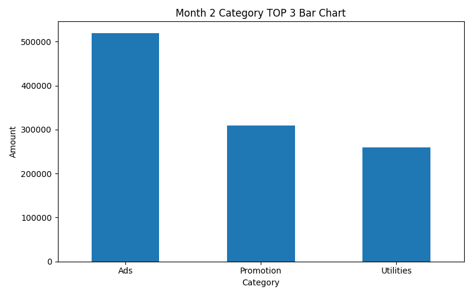

# Monthly Cost Analysis Report

비용 데이터를 분석하여 월별 및 부서별 비용 흐름을 확인하고, 사용자가 입력한 월의 부서별 총비용과 category TOP 3, 그래프를 출력하는 Python 프로젝트이며 pandas 학습과 회계/비용 데이터 분석을 결합한 프로젝트입니다.

## Tech Stack
- Python
- pandas
- matplotlib

## Features
- CSV 파일 불러오기
- 날짜 컬럼을 datetime으로 변환
- month 컬럼 생성
- 부서별 총비용 계산
- 월별 총비용 계산
- 사용자가 입력한 월의 부서별 총비용 출력
- 사용자가 입력한 월의 category TOP 3 출력
- 사용자가 입력한 월의 category TOP 3 그래프 저장 및 출력
- 가장 비용이 높은 category 요약 문장 출력
- try / except를 이용한 입력값 검증

## Project Structure
```text
monthly-cost-analysis-report/
├── main.py
├── README.md
├── data/
│   └── cost_data.csv
├── result/
│   └── 3_category_top3.png
└── .gitignore
```

## How to Run
1. data/cost_data.csv 파일을 준비합니다.
2. 아래 명령어를 실행합니다

```bash
python3 main.py
```

## Result

## Example Output Graph

아래 그래프는 선택한 달의 Category TOP 3 비용 내역을 보여줍니다.



## What I Learned
- pandas로 CSV 데이터를 불러오고 전처리하는 방법
- groupby()를 사용해 부서별, 월별, category별 비용을 집계하는 방법
- 사용자 입력값에 따라 특정 월 데이터만 필터링하는 방법
- try / except를 사용해 입력값을 검증하는 방법
- 작은 분석 프로그램에서 함수를 나누고 재사용하는 방법
- matplotlib으로 집계 결과를 시각화하는 방법
- 분석 결과를 이미지 파일로 저장하는 방법

## Notes

이 프로젝트는 Python과 pandas를 사용하여 비용 분석, 함수 구조, 간단한 보고 workflow를 연습하기 위해 제작된 Entry-level의 포트폴리오 프로젝트입니다.